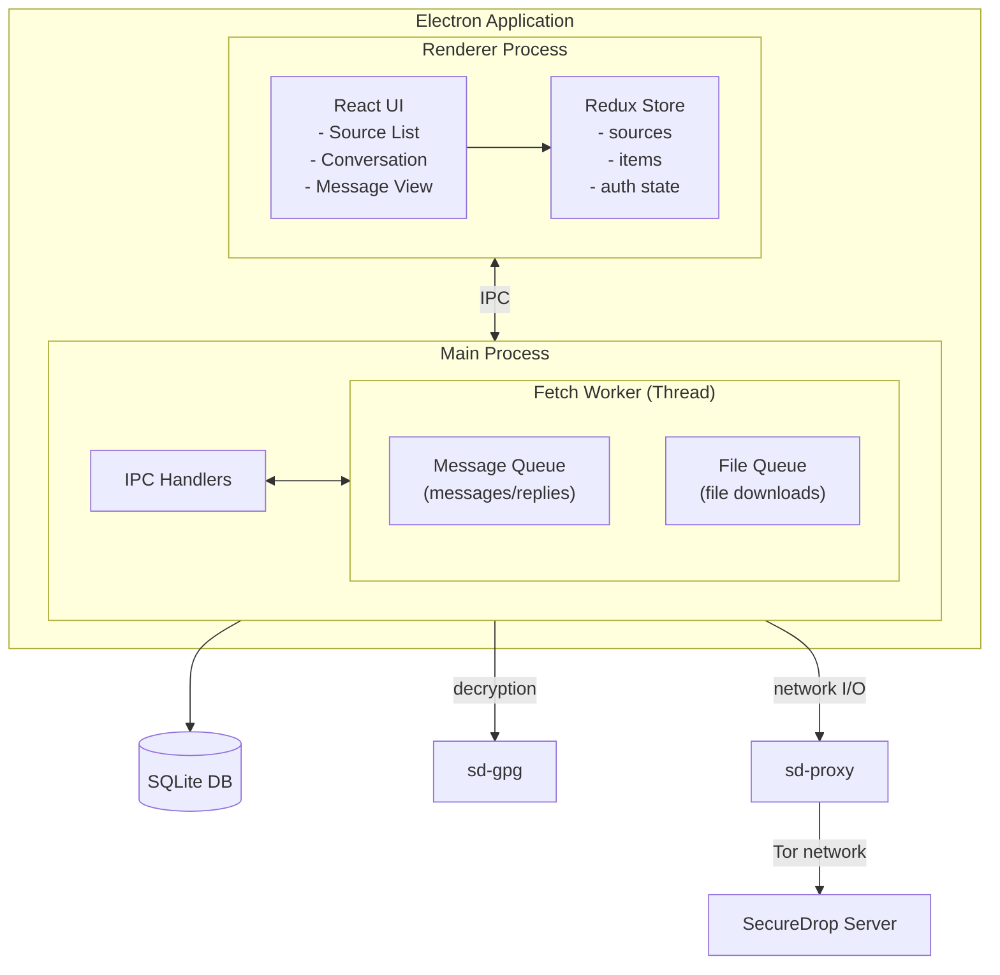
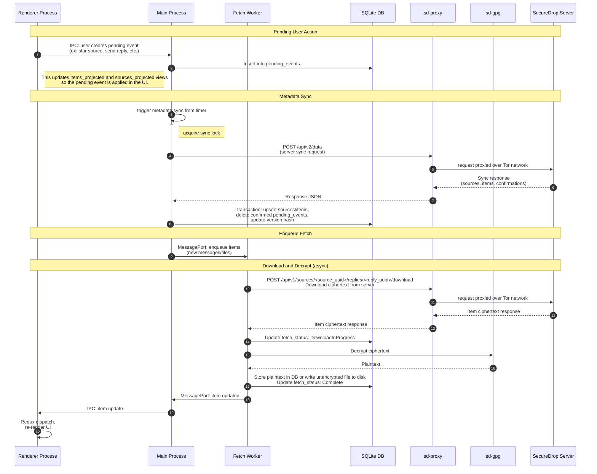
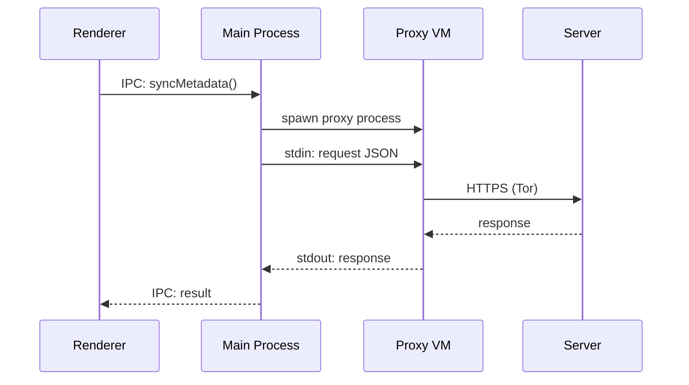
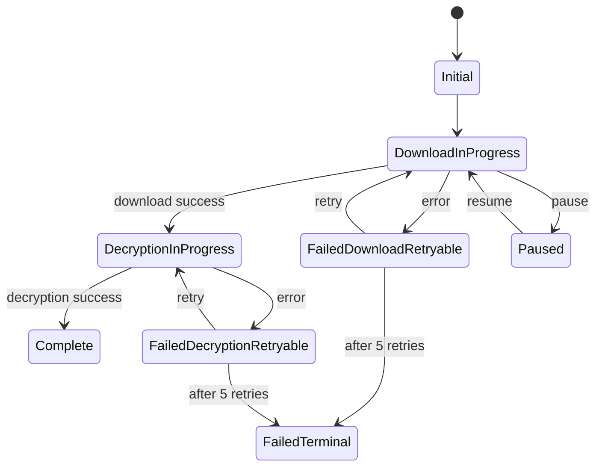

# SecureDrop App Architecture

The SecureDrop App is an Electron application written in TypeScript that provides a user interface for the [SecureDrop Workstation](https://github.com/freedomofpress/securedrop-workstation/tree/main) on Qubes OS, allowing users to securely download and decrypt messages and submissions from sources and send replies. For comprehensive documentation on the entire system, see the Workstation documentation.

The core components of the application are:

- Renderer process: runs the React UI. The renderer comunicates with the application via [Electron IPC](https://www.electronjs.org/docs/latest/tutorial/ipc). The App's IPC API is defined in [preload/index.ts](./src/preload/index.ts).
- Main process: backend of the Electron application. Performs all database and filesystem access, proxied network requests, and cryptographic operations.
- Fetch Worker: a Node.js worker thread spawned from the main process to handle download and decryption without blocking the main process.
- Database (SQLite): used for persistent storage of metadata and plaintext message and file information

The application also performs network I/O and decryption as follows:

- Decryption: all cryptographic operations use GPG for decryption. All decryption occurs in the `sd-gpg` VM via `qubes-gpg-client`. (In development, this is done by shelling out and running `gpg` commands. )
- Network I/O: all network calls are go to the Qubes `sd-proxy` VM and are proxied via the [securedrop-proxy](../proxy/). (In development, the Rust proxy is built and run in a shell child process.)

## Architecture Diagram

## Data Flow

This diagram shows the end-to-end flow of how user actions are submitted to the server via sync, downloaded + decrypted in the app by the fetch workers, and dispatched as updates to the renderer.

## Component Descriptions

### Renderer Process

The renderer process runs the React-based user interface. It runs in a sandboxed environment with no direct access to the filesystem, database, or network. All operations are performed via IPC calls to the main process.

**Key responsibilities:**

- Rendering the source list, conversation view, and message panels
- Managing UI state via Redux
- Dispatching user actions (login, send reply, download file) to the main process

#### Preload Script + IPC API

The [preload script](./src/preload/index.ts) uses Electron's `contextBridge` to expose the IPC API (`window.electronAPI`) that the renderer can use to communicate with the main process.

### Main Process

The main process is the core of the application. It handles all core backend logic including database access, cryptographic operations, file system access, and network requests.

**Key responsibilities:**

- Application lifecycle (window creation, quit handling)
- IPC handler registration and dispatch
- Database operations (SQLite via `better-sqlite3`)
- Network requests to sync with the SecureDrop server
- Managing the fetch worker for downloads
- Print and export operations (via Qubes disposable VMs)

### Database (SQLite)

The application uses SQLite with the `better-sqlite3` library for persistent storage. The database stores:

| Table            | Purpose                                                            |
| ---------------- | ------------------------------------------------------------------ |
| `sources`        | Source metadata (journalist designation, public key, flags)        |
| `items`          | Submissions, messages, and replies with fetch status and plaintext |
| `journalists`    | Journalist account metadata                                        |
| `pending_events` | Client-side actions awaiting server sync                           |
| `state_history`  | Version hashes for sync reconciliation                             |

**Key features:**

- Stores objects as JSON blobs from the server, using `json_extract` to denormalize certain fields for easier access and querying
- Schema migrations via `dbmate`
- Transaction-based updates for consistency
- Generated columns for computed fields (e.g., `is_read`, `last_updated`)
- Views (`sources_projected`, `items_projected`) that project pending events onto current state

Schema is stored in [db.sqlite](./src/main/database/schema.sql) ([more documentation here](./src/main/database/schema.md)) and the interface is defined in [database/index.ts](./src/main/database/index.ts)

### Encryption and Decryption

All cryptographic operations use GPG for decryption. The application supports two modes:

| Mode        | Command            | Key Storage             |
| ----------- | ------------------ | ----------------------- |
| Qubes       | `qubes-gpg-client` | `sd-gpg` VM (split-gpg) |
| Development | `gpg --homedir`    | Local keyring           |

In production, encrypted data from the server is decrypted by the application using the `sd-gpg` VM and Qubes split-gpg functionality. This ensures that:

- Decryption keys only live on the `sd-gpg` VM
- Decryption is done in the isolated `sd-gpg` VM

After decryption, plaintext messages are stored in the SQLite database and files are written to disk on the `sd-app` VM with the filepath persisted to SQLite.

Replies are encrypted with the OpenPGP.js library using the source's public key.

### Networking

**All network traffic passes through the Qubes proxy VM (`sd-proxy`).** The Electron application never makes direct network connections. This ensures that the application VM can run without direct network access, and that all requests go through Tor network via the proxy VM.

#### Request Flow

The proxy is spawned as a child process. Requests are written to stdin as JSON; responses are read from stdout. For file downloads, the response body is streamed directly to disk.

| Request Type     | Method          | Timeout                      |
| ---------------- | --------------- | ---------------------------- |
| Metadata sync    | JSON request    | 5 seconds                    |
| Message download | Buffered stream | 20 seconds                   |
| File download    | Stream to disk  | Dynamic (based on file size) |

### Fetch Worker (Message/File Download + Decryption)

The [fetch worker](./src/main/fetch/worker.ts) runs in a separate Node.js worker thread to avoid blocking the main process during long-running network I/O and decryption. The fetch worker is responsible for managing all message and file ciphertext download, and message and file decryption.

It maintains two task queues:

| Queue         | Items             | Timeout                 | Purpose              |
| ------------- | ----------------- | ----------------------- | -------------------- |
| Message Queue | Messages, replies | 1 minute                | Small text items     |
| File Queue    | File submissions  | Dynamic (up to 2 hours) | Large file downloads |

The worker communicates with the main process via `MessagePort`. When an item is downloaded and decrypted, the worker posts an update message that the main process forwards to the renderer.

The fetch worker writes directly to the SQLite database and filesystem, spawns decryption operations, and makes proxied network requests to download file and message ciphertext.

#### Fetch Status Lifecycle

Items progress through fetch states to allow for resumability and retries. The worker will automatically retry failed downloads or decryptions until the item is either `Complete` or fails repeatedly, entering `FailedTerminal` state.

On retryable decryption failures, the encrypted data is preserved on disk so the download doesn't need to be repeated. Downloads are also progressively streamed so that incremental progress can be retried and resumed. After 6 retries, items enter the terminal failure state and are removed from the queue.

## Server Sync

The sync process keeps the client synchronized with the SecureDrop server. The client receives updated information from the server and submits its own write events in the same sync flow.
**See also:** [server-side documentation](https://github.com/freedomofpress/securedrop/blob/develop/API2.md)

### Sync Flow

1. **Acquire Lock:** A mutex prevents concurrent syncs.

2. **Fetch Index:** The client requests `/api/v2/index` with an ETag header containing the current version hash. If the server returns `304 Not Modified`, no updates are needed.

3. **Reconcile:** The client compares the server's index against local state and:
   - Identifies new or updated sources/items
   - Fetches pending events (starred, deleted, seen) to submit

4. **Batch Request:** The client POSTs to `/api/v2/data` with:
   - Source/item UUIDs to fetch
   - Pending events to submit

5. **Apply Updates:** In a transaction:
   - Upserts updated sources and items
   - Delete successfully synced pending events from `pending_events` table
   - Delete items no longer on server
   - Updates version hash

6. **Trigger Downloads:** New items are queued in the fetch worker for asynchronous download and decryption.

### Pending Events

User actions that modify server state are stored as pending events until confirmed:

| Event Type                    | Description                                               |
| ----------------------------- | --------------------------------------------------------- |
| `source_starred`              | Source starred by journalist                              |
| `source_unstarred`            | Source unstarred                                          |
| `source_deleted`              | Source deleted                                            |
| `source_conversation_deleted` | Source conversation (all submissions and replies) deleted |
| `item_deleted`                | Item deleted                                              |
| `item_seen`                   | Reply marked as read                                      |
| `reply_sent`                  | New reply submitted                                       |

Pending events use Snowflake IDs for ordering. The `sources_projected` and `items_projected` database views show the expected state after pending events are applied. This allows the UI to display pending event state even while the events are not yet synced to the server.

Once pending events are accepted from sync, they are deleted from the `pending_events` table.
