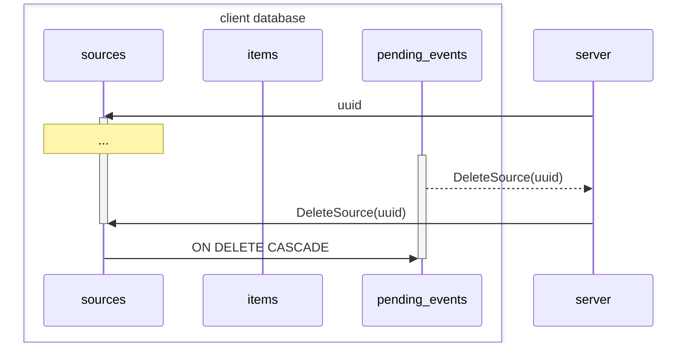
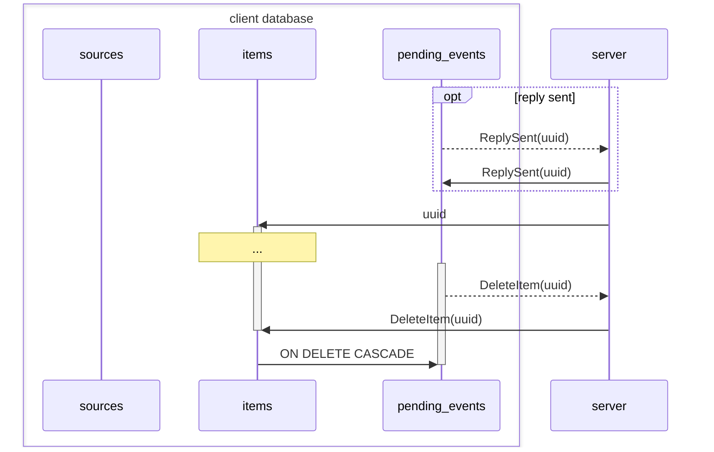

## Source lifecycle versus `pending_events.source_uuid` foreign-key relationship

A source must exist locally before other events (including deletion) can be
created for it.

All events (including deletion) for a source will be deleted when the source is
deleted.

## Item lifecycle versus `pending_events.item_uuid` foreign-key relationship

An item must exist locally (including via `ReplySent`) before other events
(including deletion) can be created for it.

All events (including deletion) for an item will be deleted when the item is
deleted.

