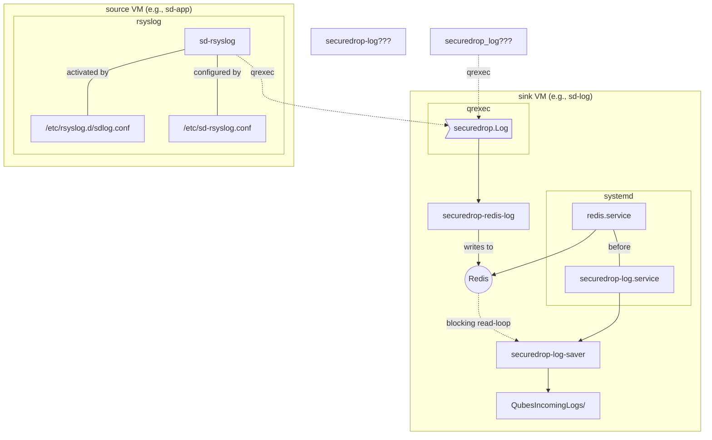

# securedrop-log

`securedrop-log` is part of the [SecureDrop
Workstation](https://github.com/freedomofpress/securedrop-workstation) project.

This is a Python module and qrexec service for logging in Qubes.

## Quick Start

1. [Install Poetry](https://python-poetry.org/docs/#installing-with-the-official-installer)
2. Run `make test` to verify the installation

## Architecture



## How to use/try this?

In our example, we will use a vm named *logging* for storing logs, and we will use
*workvm* to send in logs to the *logging* vm.

### In dom0

- Create a file `/etc/qubes-rpc/policy/securedrop.Log` in `dom0` with the following content.

```
workvm logging allow
@anyvm @anyvm deny
```

### In logging vm

Add the following content to `/etc/qubes-rpc/securedrop.Log`

```
/usr/sbin/securedrop-log
```

and then place `securedrop-redis-log` and `securedrop-log-saver` scripts to the
virtualenv at `/opt/venvs/securedrop-log` and create links to `/usr/sbin/`
directory and make sure that they are executable. This step will be automated via
the Debian package.


Copy `securedrop-log.service` file to `/usr/systemd/system` and then

```
sudo systemctl daemon-reload
sudo systemctl start redis
sudo systemctl start securedrop-log
```

To test the logging, make sure to execute `securedrop-log-saver` from a terminal in `sd-log`
and check the ~/QubesIncomingLogs/vmname/syslog.log file via **tail -f**.


### To use from any Python code in workvm

Put `sd-rsyslog-example.conf` file to `/etc/sd-rsyslog.conf`, make sure update
it so that is shows the right **localvm** name.

Copy `sd-rsyslog` executable to **/usr/sbin**, and remember to `chmod +x`
the binary.

Next, restart the rsyslog service.

```
systemctl restart rsyslog
```


Here is an example code using Python logging

```Python
import logging
import logging.handlers

def main():
    handler = logging.handlers.SysLogHandler(address="/dev/log")
    logging.basicConfig(level=logging.DEBUG, handlers=[handler])
    logger = logging.getLogger("example")

    logger.info("kushal says it works")


if __name__ == "__main__":
    main()

```

Or use the logger command.

```
logger This line should show in the syslog.log file in the sd-log file.
```
