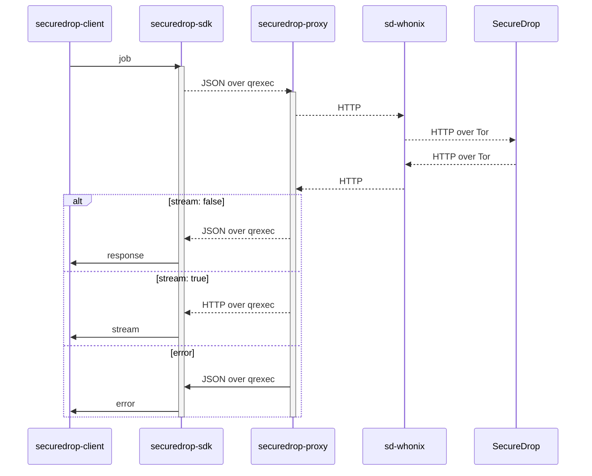

## securedrop workstation proxy

`securedrop-proxy` is part of the [SecureDrop
Workstation](https://github.com/freedomofpress/securedrop-workstation) project.

The code in this repository implements a proxy across two APIs: the [Qubes RPC
protocol](https://www.qubes-os.org/doc/qrexec/) and the [SecureDrop
API](https://developers.securedrop.org/en/latest/journalist_api.html).
This proxy is used to forward requests from the securedrop workstation client to
the securedrop server.

The proxy is implemented in Rust. The tests are implemented in Python.

The proxy is packaged as the `securedrop-proxy` Debian package, which is
installed in the `sd-proxy` VM after provisioning a SecureDrop Workstation.

## Security Properties

### Isolation

The SecureDrop Client/SDK can talk only to the proxy. The proxy talks only to
the (onion) origin it's configured with.

**Mitigates against:** A compromised Client/VM tries to contact or exfiltrate
data to an arbitrary origin.

### Sanitization

The SDK talks JSON. The proxy translates JSON to HTTP and back again. (In v3, it
will just construct a sanitized HTTP request and do the same for the response.)

**Mitigates against:** A compromised Client/VM constructs a malicious HTTP
request. (The server returning a malicious HTTP response is already game over.)

## How It Works



The proxy works by reading a JSON object from the standard input, generating an
HTTP request from that JSON, making that request against the remote server, and
then either (a) writing to the standard output a JSON object which represents
the remote server's response or (b) streaming the response directly to the
standard output.

## Quick Start


1. Install Rust from Debian stable packages or via [rustup](https://rustup.rs/)
2. [Install Poetry](https://python-poetry.org/docs/#installing-with-the-official-installer)
3. Run `make test` to build the proxy using Rust and verify the installation

## Managing Dependencies

We use Poetry to manage Python test dependencies for this project, and Cargo to manage Rust dependencies.
See our [documentation for managing dependencies](https://developers.securedrop.org/en/latest/dependency_updates.html).

## Making a Release

See our [documentation for releasing Debian packages](https://developers.securedrop.org/en/latest/workstation_release_management.html#release-a-debian-package).

## Configuration

In development, the proxy should be run with the `SD_PROXY_ORIGIN` environment
variable set, like:

```sh-session
$ export SD_PROXY_ORIGIN=http://${JOURNALIST_INTERFACE}.onion
```

In a production build with the `qubesdb` feature, the same value is expected in
the Qubes feature `vm-config.SD_PROXY_ORIGIN`, exposed in QubesDB at
`/vm-config/SD_PROXY_ORIGIN`. You can simulate this, including on Qubes 4.1+,
with:

```sh-session
[user@dom0 ~] qubesdb-write sd-proxy -c write /vm-config/SD_PROXY_ORIGIN "http://${JOURNALIST_INTERFACE}.onion"
```

## Tests

Unit tests can be run with `make test`.