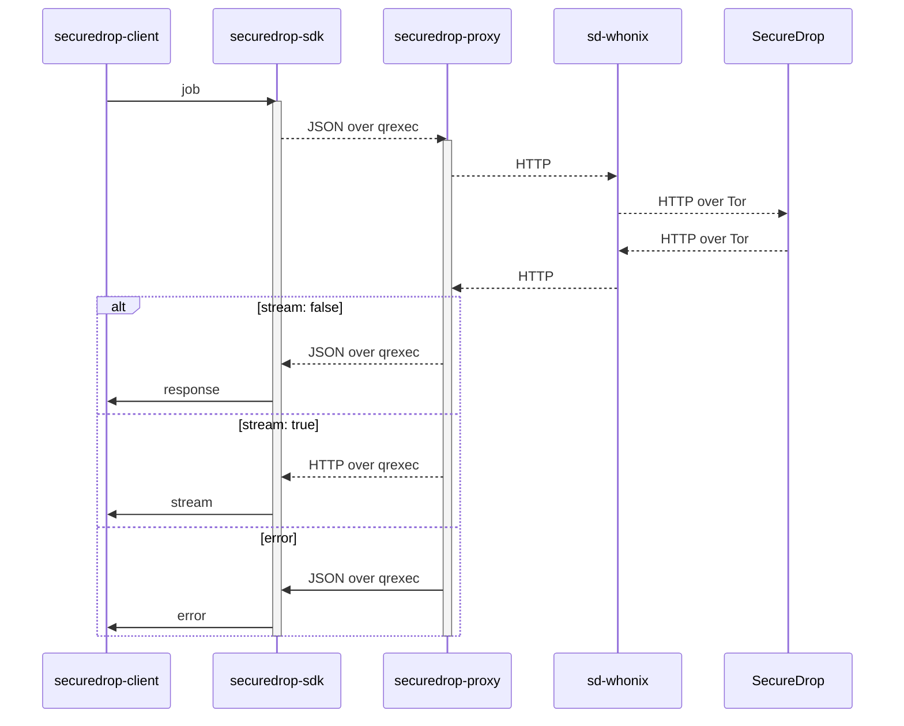

## securedrop workstation proxy

`securedrop-proxy` is part of the [SecureDrop
Workstation](https://github.com/freedomofpress/securedrop-workstation) project.

The code in this repository implements a proxy across two APIs: the [Qubes RPC
protocol](https://www.qubes-os.org/doc/qrexec3/) and the [SecureDrop
API](https://docs.securedrop.org/en/latest/development/journalist_api.html).
This proxy is used to forward requests from the securedrop workstation client to
the securedrop server.

This code is still in development, and not quite ready for integration with the
rest of the Securedrop Workstation project. However, it is ready to be poked at
and demonstrated. Feel free to explore and contribute! You'll need a machine
running [Qubes OS](https://qubes-os.org).

## Security Properties

### Isolation

The SecureDrop Client/SDK can talk only to the proxy. The proxy talks only to
the (onion) origin it's configured with.

**Mitigates against:** A compromised Client/VM tries to contact or exfiltrate
data to an arbitrary origin.

### Sanitization

The SDK talks JSON. The proxy translates JSON to HTTP and back again. (In v3, it
will just construct a sanitized HTTP request and do the same for the response.)

**Mitigates against:** A compromised Client/VM constructs a malicious HTTP
request. (The server returning a malicious HTTP response is already game over.)

## How It Works



The proxy works by reading a JSON object from the standard input, generating an
HTTP request from that JSON, making that request against the remote server, and
then either (a) writing to the standard output a JSON object which represents
the remote server's response or (b) streaming the response directly to the
standard output. For discussion about the shape of the request and response
objects, see
https://github.com/freedomofpress/securedrop-workstation/issues/107.

## Quick Start

1. [Install Poetry](https://python-poetry.org/docs/#installing-with-the-official-installer)
2. Run `make test` to verify the installation

## Managing Dependencies

We use Poetry to manage dependencies for this project.

### Development dependencies

You can add development dependencies via  `poetry add <name> --group dev`.
Make sure you commit changes to the lockfile along with changes to `pyproject.toml`.

To update the dependency to the latest version within the specified
version constraints, simply run `poetry update <name>` and commit the resutling
changes.

To update to a new major version (e.g., from 1.0.0 to 2.0.0), you will typically have to
update `pyproject.toml`.

### Production dependencies

To add a production dependency, use `poetry add <name>`, and to update it,
use `poetry update <name>`.

For our production Debian packages, we use locally built wheels instead of
downloading wheels from PyPI.

This means that whenever you add or update a production dependency, you also
have to build and commit a new wheel according to the process described in the
[securedrop-builder](https://github.com/freedomofpress/securedrop-builder)
repository.

This will result in an updated `build-requirements.txt` file you can add to your
PR in this repository.

## Making a Release

1. Update versions: `./update_version.sh $new_version_number` and add a new entry in the changelog.
2. Commit the changes with commit message `securedrop-proxy $new_version_number` and make a PR.
3. You should confirm via a manual debian package build and manual testing in Qubes that there are no regressions (this is limited pre-release QA).
4. Once your PR is approved, you can add a tag: `git tag $new_version_number`.
5. Perform the release signing ceremony on the tag. Push the tag.
6. The signer should create the source tarball via `python3 setup.py sdist`.
7. Add a detached signature (with the release key) for the source tarball.
8. Submit the source tarball and signature via PR into this [repository](https://github.com/freedomofpress/securedrop-debian-packaging). This tarball will be used by the package builder.

## Configuration

In development, the proxy should be run with the `SD_PROXY_ORIGIN` environment
variable set, like:

```sh-session
$ export SD_PROXY_ORIGIN=http://${JOURNALIST_INTERFACE}.onion
```

In a production build with the `qubesdb` feature, the same value is expected in
the Qubes feature `vm-config.SD_PROXY_ORIGIN`, exposed in QubesDB at
`/vm-config/SD_PROXY_ORIGIN`. Yo can simulate this, including on Qubes 4.1,
with:

```sh-session
[user@dom0 ~] qubesdb-write sd-proxy -c write /vm-config/SD_PROXY_ORIGIN $JOURNALIST_INTERFACE
```

## Tests

Unit tests can be run with `make test`.

## Example Commands

The following commands can be used to demonstrate the proxy.

This demonstrates proxying a request which has an `application/json` response:

    $ cat examples/posts.json | ./sd-proxy.py ./config-example.yaml

This demonstrates proxying a request which has a `text/html` response
and thus is saved to a temp file. The name of the temp file is
included in the result printed to STDOUT- in dev mode, the file can be
read at that name under `/tmp`.

    $ cat examples/html.json | ./sd-proxy.py ./config-example.yaml

Finally, this demonstrates some error handling. The request contains invalid
JSON. The proxy detects the malformed request, and prints an error message.
(The error message itself is considered a valid proxy response).

    $ cat examples/bad.json | ./sd-proxy.py ./config-example.yaml

## Qubes Integration

Until we determine how we wish to package and install this script,
demonstrating the proxy in a Qubes environment is a somewhat manual
process.

First, determine which of your VMs will be acting as the proxy VM
(where this code will be running), and which will be acting as the
client VM (where the client code will be running). For the purposes of
this documentation, we assume the client is running in
`securedrop-client`, and the proxy is running in `securedrop-proxy`.

Edit `qubes/securedrop.Proxy` to reflect the path to `entrypoint.sh`
in this repo. Also edit the directory to this repo code in `entrypoint.sh`.
Next, run `sudo cp qubes/securedrop.Proxy /etc/qubes-rpc/securedrop.Proxy`.
This will move `securedrop.Proxy` (the qubes-rpc "server path definition" file)
into place in `/etc/qubes-rpc/`.

In `dom0`, create the file `/etc/qubes-rpc/policy/securedrop.Proxy`
with the contents

    securedrop-client securedrop-proxy allow
    @anyvm @anyvm deny

Replace the VM names in the first line above with the correct source and
destination names for your environment. The second line should appear as is.

Also in `dom0`, edit `/etc/qubes-rpc/policy/qubes.Filecopy`, to add
near the top:

    securedrop-proxy securedrop-client allow

(again replacing the VM names with the correct source and destination
names for your environment). This allows non-JSON responses to be
moved to the client VM using Qubes' native inter-VM file copy service.

Copy `config-example.yaml` to `config.yaml`, and edit it to reflect
your situation. Ensure that `target_vm` is set to the correct client VM
name, and that `dev` is `False`. This documentation assumes
you've left `host` set to `jsonplaceholder.typicode.com`.

At this point, in the client VM you should be able to do

    $ echo '{"method":"GET","path_query":"/posts?userId=1"}' | /usr/lib/qubes/qrexec-client-vm securedrop-proxy securedrop.Proxy

(again replacing `securedrop-proxy` with the name of your proxy AppVM)
You should see a successful JSON response as returned by the remote server.

Try now

    $ echo '{"method":"GET","path_query":""}' | /usr/lib/qubes/qrexec-client-vm securedrop-proxy securedrop.Proxy

If you have configured everything correctly, you should see a JSON
response which include a `body` which looks like:

    { ...
      "body": "{\"filename\": \"7463c589-92d2-46ba-845f-3ace2587916d\"}"
    }

If you look in `~/QubesIncoming/securedrop-proxy`, you should see a
new file with that name. The content of that file will reflect the content
returned by the remote server.

Finally, try invoking an error by providing an invalid JSON request.
Notice that you receive a `400` response from the proxy:

    $ echo '[INVALID' | /usr/lib/qubes/qrexec-client-vm securedrop-proxy securedrop.Proxy
    {"body": "{\"error\": \"Invalid JSON in request\"}", "version": "0.1.1", "status": 400, "headers": {"Content-Type": "application/json"}}
