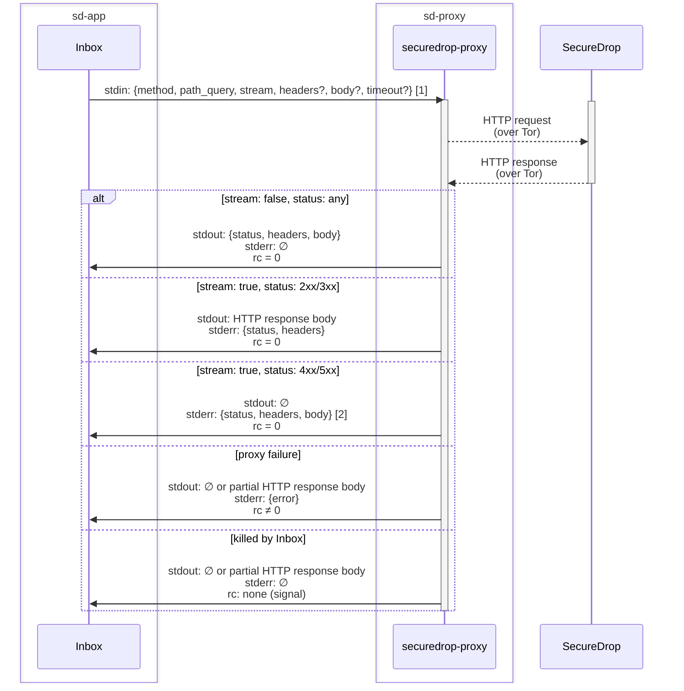

## SecureDrop Workstation proxy

`securedrop-proxy` is part of the [SecureDrop
Workstation](https://github.com/freedomofpress/securedrop-workstation) project.

The code in this repository implements a proxy across two APIs: the [Qubes RPC
protocol](https://www.qubes-os.org/doc/qrexec/) and the [SecureDrop Journalist
API](https://developers.securedrop.org/en/latest/journalist_api.html).
This proxy is used to forward requests from the [SecureDrop Inbox](../app/) to
the [SecureDrop server](https://github.com/freedomofpress/securedrop).

The proxy is implemented in Rust. The tests are implemented in Python.

The proxy is packaged as the `securedrop-proxy` Debian package, which is
installed in the `sd-proxy` VM after provisioning a SecureDrop Workstation.

## Security Properties

### Isolation

The SecureDrop Inbox (in the `sd-app` VM) can talk only to the proxy. The proxy
(in the `sd-proxy` VM) talks only to the (onion) origin it's configured with.

**Mitigates against:** A compromised Inbox or `sd-app` VM tries to contact or
exfiltrate data to an arbitrary origin.

### Sanitization

The Inbox talks JSON. The proxy translates JSON to HTTP and back again. (In v3, it
will just construct a sanitized HTTP request and do the same for the response.)

**Mitigates against:** A compromised Inbox or `sd-app` VM constructs a malicious HTTP
request. (The server returning a malicious HTTP response is already game over.)

## How It Works

_Solid and dashed lines indicate plaintext and encrypted connections,
respectively. Boxes indicate VMs; lines between VMs take place over qrexec._


```mermaid
sequenceDiagram

box sd-app
participant c as Inbox
end
box sd-proxy
participant p as securedrop-proxy
end
participant s as SecureDrop

c ->> p: stdin: {method, path_query, stream, headers?, body?, timeout?} [1]
activate p
activate s
p -->> s: HTTP request<br>(over Tor)
s -->> p: HTTP response<br>(over Tor)
deactivate s

alt stream: false, status: any
p ->> c: stdout: {status, headers, body}<br>stderr: ∅<br>rc = 0
else stream: true, status: 2xx/3xx
p ->> c: stdout: HTTP response body<br>stderr: {status, headers}<br>rc = 0
else stream: true, status: 4xx/5xx
p ->> c: stdout: ∅<br>stderr: {status, headers, body} [2]<br>rc = 0
else proxy failure
p ->> c: stdout: ∅ or partial HTTP response body<br>stderr: {error}<br>rc ≠ 0
else killed by Inbox
p ->> c: stdout: ∅ or partial HTTP response body<br>stderr: ∅<br>rc: none (signal)
end

deactivate p
```

**Notes:**

1. The request on the standard input MUST be a single-line JSON object, at most
   [`STDIN_LIMIT`] long.

2. `body` MUST be capped at some length (TBD).

## Quick Start

1. Install Rust from Debian stable packages or via [rustup](https://rustup.rs/)
2. [Install Poetry](https://python-poetry.org/docs/#installing-with-the-official-installer)
3. Run `make test` to build the proxy using Rust and verify the installation

## Managing Dependencies

We use Poetry to manage Python test dependencies for this project, and Cargo to manage Rust dependencies.
See our [documentation for managing dependencies](https://developers.securedrop.org/en/latest/dependency_updates.html).

## Making a Release

See our [documentation for releasing SecureDrop Workstation Debian packages](https://developers.securedrop.org/en/latest/workstation_release_management.html#release-a-debian-package).

## Configuration

In development, the proxy should be run with the `SD_PROXY_ORIGIN` environment
variable set, like:

```sh-session
$ export SD_PROXY_ORIGIN=http://${JOURNALIST_INTERFACE}.onion
```

In a production build with the `qubesdb` feature, the same value is expected in
the Qubes feature `vm-config.SD_PROXY_ORIGIN`, exposed in QubesDB at
`/vm-config/SD_PROXY_ORIGIN`. You can simulate this, including on Qubes 4.1+,
with:

```sh-session
[user@dom0 ~] qubesdb-write sd-proxy -c write /vm-config/SD_PROXY_ORIGIN "http://${JOURNALIST_INTERFACE}.onion"
```

## Tests

Unit tests can be run with `make test`.

[`STDIN_LIMIT`]: https://github.com/freedomofpress/securedrop-client/blob/a00eb5da9b6795d09bbbcd524484d1543c1289d5/proxy/src/main.rs#L34
